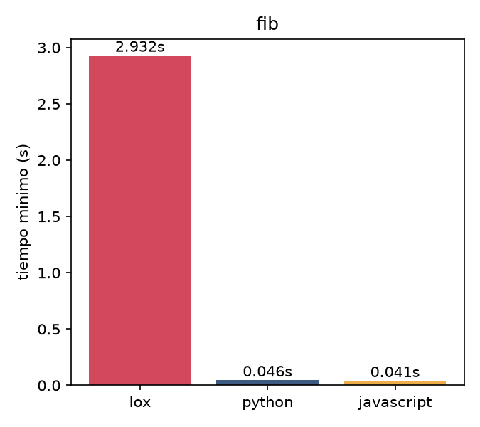
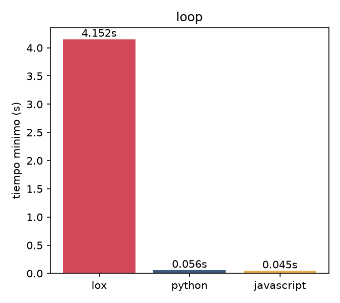
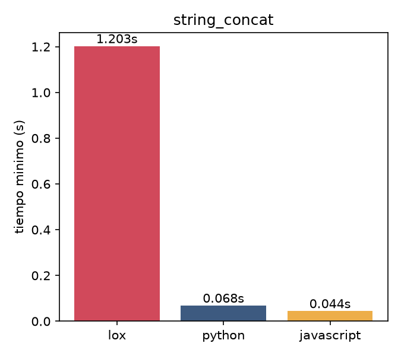

# Reporte: Lox vs Python vs JavaScript

Resultado de las pruebas de rendimiento, presentadas con un grafico y una tabla por benchmark, con el tiempo de proceso completo en segundos: minimo, promedio y maximo de varias corridas.

## Fib

**Que se probo:** Recursion y llamadas a funcion: calcula `fib(24)` de forma recursiva, la misma logica en los tres lenguajes.

| Lenguaje | MIN (s) | AVG (s) | MAX (s) |
|---|---:|---:|---:|
| lox | 2.9316 | 2.9813 | 3.0297 |
| python | 0.0460 | 0.0499 | 0.0545 |
| javascript | 0.0409 | 0.0441 | 0.0494 |

## Loop

**Que se probo:** Loop apretado: un `while` de 200.000 iteraciones que en cada vuelta evalua una condicion, hace una suma y un incremento.

| Lenguaje | MIN (s) | AVG (s) | MAX (s) |
|---|---:|---:|---:|
| lox | 4.1516 | 4.2111 | 4.3382 |
| python | 0.0563 | 0.0584 | 0.0624 |
| javascript | 0.0451 | 0.0469 | 0.0501 |

## Concatenación de strings

**Que se probo:** Creacion/descarte de strings: 50.000 concatenaciones sucesivas que arman una cadena de largo creciente.

| Lenguaje | MIN (s) | AVG (s) | MAX (s) |
|---|---:|---:|---:|
| lox | 1.2025 | 1.2242 | 1.2517 |
| python | 0.0684 | 0.0725 | 0.0774 |
| javascript | 0.0443 | 0.0487 | 0.0548 |

## Conclusiones

- Lox es entre **18x** y **92x** mas lento que Python y JavaScript en estos tres benchmarks. Es el costo esperado de un tree-walk interpreter puro (recorre el AST con `singledispatchmethod` y crea un `Environment` nuevo por cada llamada/bloque) corriendo, a su vez, sobre el interprete de Python -- dos capas de interpretacion.
- La brecha mas chica esta en `string_concat` (~18x-27x): ahi el costo dominante (crear y copiar strings) es compartido por las tres implementaciones, asi que el overhead del AST pesa relativamente menos.
- La brecha mas grande esta en `loop` y `fib`: son benchmarks donde casi todo el tiempo se va en operaciones "chicas" (sumar, comparar, llamar a una funcion) que en Lox pasan por varias capas de despacho por nodo de AST, mientras que Python y sobre todo V8 (JavaScript) las compilan a bytecode/maquina muy directamente.
- Esto es exactamente la motivacion de la Entrega Final: agregar una fase de compilacion a bytecode deberia acortar esta brecha, en particular en `loop` y `fib`, porque elimina el recorrido repetido del AST por cada iteracion/llamada.
